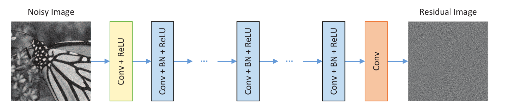
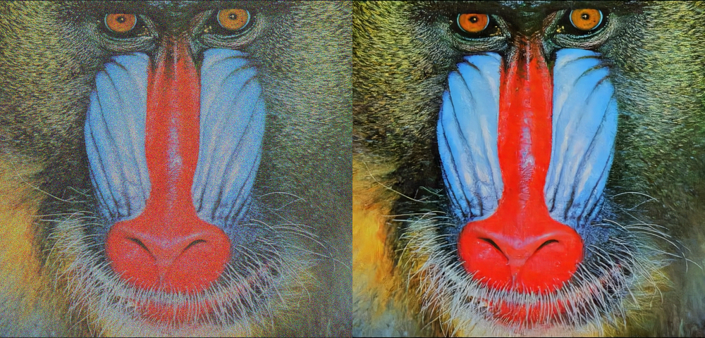

# Beyond a Gaussian Denoiser: Residual Learning of Deep CNN for Image Denoising
# DnCNN-Tensorflow
This is a tensorflow re-implementation of [Beyond a Gaussian Denoiser: Residual Learning of Deep CNN for Image Denoising](https://arxiv.org/abs/1608.03981).
***
# Requirements
1. Tensorflow==1.8
2. opencv-python 
***
#Model Architecture

***
# Results

